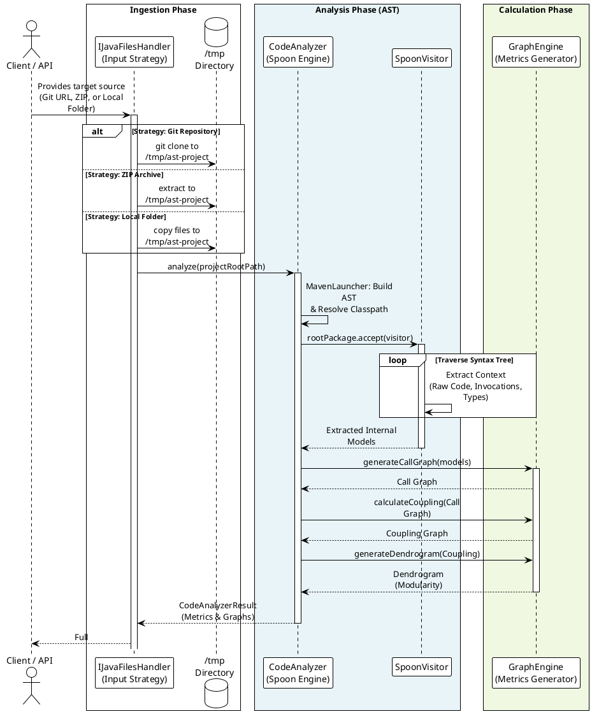

# Java Static Code Analyzer

**Author:** Miguel Delhelle

This program is a static code analyzer written in Java. It extracts key metrics from a codebase to evaluate its structure and health.

## Features & Metrics
The analyzer computes the following metrics:
* Total number of packages, classes, and methods
* Total lines of code
* Average number of methods per class
* Average lines of code per method
* Average number of attributes per class

## Architecture Analysis & Graphs
* **Call Graph:** Maps all method invocations across the application.
* **Coupling Graph:** Calculates the bidirectional coupling between classes.
    * *Formula:* `Coupling(A,B) = Coupling(B,A)`. It is defined as the number of method calls between two classes divided by the total number of methods in A and B.
    * *Objective:* Visualizing this data helps identify architectural flaws, encouraging **low coupling and high cohesion** for better long-term maintainability.
* **Module Clustering:** Groups components into logical modules, visualized through a generated **Dendrogram**.

## Project Status & Development
* **Backend:** The entire Java analysis engine was built from scratch with library Spoon a wrapper of Jdt Eclipse.
* **Frontend:** Currently undergoing a massive architectural overhaul for better performance and maintainability. The initial interface prototype was scaffolded using the Gemini 2.5 Pro language model.
* **Active Maintenance:** This project is actively developed. Current efforts are focused on codebase refinement, reintroducing robust unit tests, enhancing exception handling, and fixing bugs.

## Execution Flow
Sequence diagram representing the program's Input/Output lifecycle:

