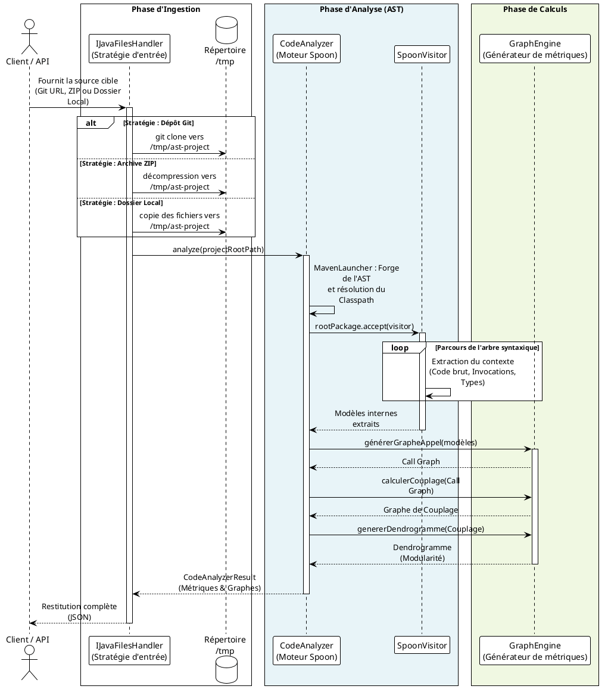

# Analyseur Statique de Code Java

**Auteur :** Miguel Delhelle

Ce programme est un analyseur de code statique écrit en Java. Il extrait des métriques clés d'une base de code pour évaluer sa structure et sa santé.

## Fonctionnalités & Métriques
L'analyseur calcule les métriques suivantes :
* Nombre total de packages, de classes et de méthodes
* Nombre total de lignes de code
* Nombre moyen de méthodes par classe
* Nombre moyen de lignes de code par méthode
* Nombre moyen d'attributs par classe

## Analyse d'Architecture & Graphes
* **Graphe d'Appel (Call Graph) :** Cartographie toutes les invocations de méthodes à travers l'application.
* **Graphe de Couplage :** Calcule le couplage bidirectionnel entre les classes.
    * *Formule :* `Couplage(A,B) = Couplage(B,A)`. Il est défini comme le nombre d'appels de méthodes entre deux classes divisé par le nombre total de méthodes dans A et B.
    * *Objectif :* La visualisation de ces données aide à identifier les défauts architecturaux, encourageant un **faible couplage et une forte cohésion** pour une meilleure maintenabilité à long terme.
* **Regroupement en Modules :** Regroupe les composants en modules logiques, visualisés via la génération d'un **Dendrogramme**.

## 🛠État du Projet & Développement
* **Backend :** L'intégralité du moteur d'analyse Java a été conçue de toutes pièces en utilisant la bibliothèque Spoon, une surcouche de JDT Eclipse.
* **Frontend :** Actuellement en cours de refonte architecturale massive pour de meilleures performances et une plus grande maintenabilité. Le prototype initial de l'interface a été généré à l'aide du modèle de langage Gemini 2.5 Pro.
* **Maintenance Active :** Ce projet est activement développé. Les efforts actuels se concentrent sur le raffinement de la base de code, la réintégration de tests unitaires robustes, l'amélioration de la gestion des exceptions et la correction de bugs. **Il n'y a aucune version officielle (release) disponible en l'état à l'heure actuelle.**

## Flux d'Exécution
Diagramme de séquence représentant le cycle de vie des Entrées/Sorties du programme :

